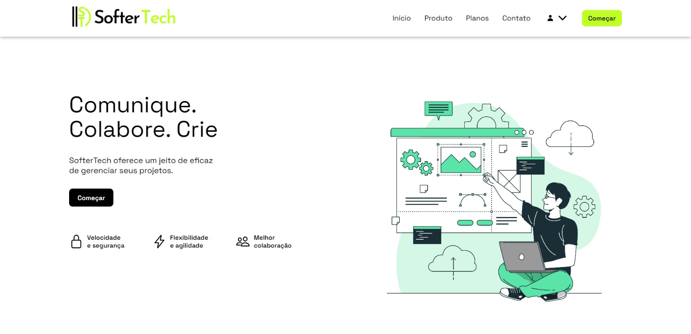

<h1 align="center"> Landing Page da SofterTech</h1>

Plataforma exclusiva e gratuita, com intuito de apresentar a Startup SofterTech.  

  <a href="#-tecnologias">Tecnologias</a>&nbsp;&nbsp;&nbsp;|&nbsp;&nbsp;&nbsp;
  <a href="#-projeto">Projeto</a>&nbsp;&nbsp;&nbsp;|&nbsp;&nbsp;&nbsp;
  <!-- <a href="#-layout">Layout</a>&nbsp;&nbsp;&nbsp;|&nbsp;&nbsp;&nbsp; -->
  <!-- <a href="#memo-licença">Licença</a> -->

<!-- 

  

 -->

 

  

## 🚀 Tecnologias

Esse projeto foi desenvolvido com as seguintes tecnologias:

- HTML e CSS
- Git e Github
- JavaScript ⏳...

## 💻 Projeto

Esta Landing Page é uma plataforma moderna que tem como funcionalidade apresentar as missões e objetivos da Startup SofterTech.
<!-- - [Acesse o projeto finalizado, online](https://maykbrito.github.io/devlinks) -->

<!-- ## 🔖 Layout
Você pode visualizar o layout do projeto através [DESSE LINK](https://www.figma.com/community/file/1187422022288947321). É necessário ter conta no [Figma](https://figma.com) para acessá-lo. -->

<!-- ## :memo: Licença
Esse projeto está sob a licença MIT. -->

---

Feito com ♥ by SofterTech :wave: <!-- [Participe da nossa comunidade!](https://discord.gg/rocketseat) -->
